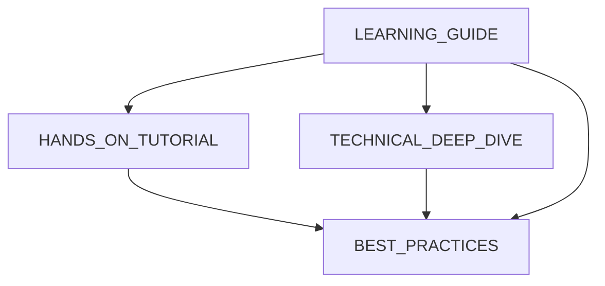

# 📚 Learning Index: Modern Data Engineering with Trino, dbt, and Spark

This index provides a structured learning path through the comprehensive learning materials created for this project.

## 🎯 Learning Path Overview

This project demonstrates a complete modern data engineering stack. Choose your learning journey based on your experience level:

### 🚀 Quick Start (30 minutes)
**Perfect for**: Getting a high-level understanding

1. **[LEARNING_GUIDE.md](./LEARNING_GUIDE.md)** - Start here for architecture overview
2. **[HANDS_ON_TUTORIAL.md](./HANDS_ON_TUTORIAL.md)** - Exercises 1-2 (Environment Setup)
3. **Project Demo** - Run `make up` and explore the running services

### 🏗️ Architecture Deep Dive (2-3 hours)  
**Perfect for**: Data engineers and architects

1. **[LEARNING_GUIDE.md](./LEARNING_GUIDE.md)** - Complete architecture section
2. **[TECHNICAL_DEEP_DIVE.md](./TECHNICAL_DEEP_DIVE.md)** - Advanced patterns and implementation
3. **[HANDS_ON_TUTORIAL.md](./HANDS_ON_TUTORIAL.md)** - Exercises 3-5 (Build the pipeline)
4. **Code exploration** - Examine dbt models and Docker configurations

### 🛠️ Hands-On Implementation (4-6 hours)
**Perfect for**: Learning by building and experimenting

1. **[HANDS_ON_TUTORIAL.md](./HANDS_ON_TUTORIAL.md)** - Complete all exercises
2. **[BEST_PRACTICES.md](./BEST_PRACTICES.md)** - Apply patterns to your custom models
3. **Extension exercises** - Add your own transformations and metrics

### 🎓 Expert Mastery (8+ hours)
**Perfect for**: Comprehensive understanding and production readiness

1. **Complete all learning materials**
2. **[BEST_PRACTICES.md](./BEST_PRACTICES.md)** - Production patterns and optimization
3. **[TECHNICAL_DEEP_DIVE.md](./TECHNICAL_DEEP_DIVE.md)** - Performance and scalability
4. **Real-world application** - Adapt patterns to your use cases

## 📖 Learning Materials Guide

### 📋 [LEARNING_GUIDE.md](./LEARNING_GUIDE.md)
**Purpose**: Comprehensive introduction to the project  
**Topics Covered**:
- Architecture overview and design principles
- Technology stack explanation and rationale
- Data flow through medallion architecture (Bronze → Silver → Gold)
- dbt implementation patterns
- Getting started instructions
- Key learning points and takeaways

**Best For**: Everyone - start here for foundational understanding

### 🔧 [HANDS_ON_TUTORIAL.md](./HANDS_ON_TUTORIAL.md)  
**Purpose**: Step-by-step practical exercises  
**Topics Covered**:
- Environment setup and service deployment
- Data source configuration and loading
- Building Bronze, Silver, and Gold layers
- Creating custom transformations
- Data quality testing and validation
- Performance optimization techniques
- Troubleshooting common issues

**Best For**: Hands-on learners who prefer learning by doing

### 🏛️ [TECHNICAL_DEEP_DIVE.md](./TECHNICAL_DEEP_DIVE.md)
**Purpose**: Advanced technical concepts and patterns  
**Topics Covered**:
- Medallion architecture implementation details
- Multi-engine processing strategies
- Advanced dbt patterns and configurations
- Data lake architecture with Delta Lake
- Infrastructure as code with Docker
- Performance optimization and scalability
- Security and governance patterns

**Best For**: Experienced engineers seeking advanced understanding

### 📖 [BEST_PRACTICES.md](./BEST_PRACTICES.md)
**Purpose**: Production-ready patterns and guidelines  
**Topics Covered**:
- Architecture and engine selection best practices
- dbt project organization and naming conventions
- Data quality and testing strategies
- Performance optimization techniques
- Security and governance implementation
- CI/CD and deployment patterns
- Monitoring and alerting strategies

**Best For**: Teams implementing production data pipelines

## 🎯 Learning Objectives by Material

| Material | Key Learning Outcomes |
|----------|----------------------|
| **LEARNING_GUIDE** | Understand the architecture, technology choices, and data flow patterns |
| **HANDS_ON_TUTORIAL** | Build working data pipelines, implement transformations, handle real data |
| **TECHNICAL_DEEP_DIVE** | Master advanced patterns, optimization techniques, and scaling strategies |
| **BEST_PRACTICES** | Apply production-ready patterns, implement governance, ensure reliability |

## 🛣️ Suggested Learning Paths

### Path 1: Architecture First (Conceptual → Practical)
```
LEARNING_GUIDE → TECHNICAL_DEEP_DIVE → HANDS_ON_TUTORIAL → BEST_PRACTICES
```
**Best for**: System designers, architects, senior engineers

### Path 2: Hands-On First (Practical → Conceptual)  
```
HANDS_ON_TUTORIAL → LEARNING_GUIDE → TECHNICAL_DEEP_DIVE → BEST_PRACTICES
```
**Best for**: Developers, data engineers, hands-on learners

### Path 3: Quick Implementation (Immediate Results)
```
LEARNING_GUIDE (Overview) → HANDS_ON_TUTORIAL (Exercises 1-5) → BEST_PRACTICES (Selected patterns)
```
**Best for**: Tight deadlines, proof-of-concept implementations

### Path 4: Comprehensive Mastery (Complete Understanding)
```
LEARNING_GUIDE → HANDS_ON_TUTORIAL → TECHNICAL_DEEP_DIVE → BEST_PRACTICES → Code Deep Dive → Extension Projects
```
**Best for**: Technical leads, infrastructure architects, team training

## 🎯 Learning by Use Case

### E-commerce Analytics (Current Dataset)
- **Start with**: HANDS_ON_TUTORIAL exercises 1-5
- **Focus on**: Customer segmentation, sales analytics, product performance
- **Advanced**: Custom metrics in BEST_PRACTICES

### Data Lake Implementation
- **Start with**: TECHNICAL_DEEP_DIVE (Data Lake Architecture)
- **Focus on**: Storage patterns, Delta Lake features, optimization
- **Practice**: Partitioning and storage layout exercises

### Multi-Engine Processing
- **Start with**: LEARNING_GUIDE (Technology Stack)
- **Focus on**: Engine selection patterns, cross-engine data flow
- **Advanced**: TECHNICAL_DEEP_DIVE (Multi-Engine Processing)

### dbt Best Practices
- **Start with**: LEARNING_GUIDE (dbt Implementation Patterns)
- **Focus on**: Model organization, testing, incremental strategies  
- **Advanced**: BEST_PRACTICES (dbt patterns and testing)

### Production Deployment
- **Start with**: BEST_PRACTICES (CI/CD and Infrastructure)
- **Focus on**: Security, monitoring, performance optimization
- **Advanced**: TECHNICAL_DEEP_DIVE (Infrastructure Patterns)

## 🔗 Cross-References and Dependencies

### Prerequisites for Each Material
- **LEARNING_GUIDE**: Basic SQL knowledge, familiarity with data concepts
- **HANDS_ON_TUTORIAL**: Docker installed, command line familiarity
- **TECHNICAL_DEEP_DIVE**: Understanding of LEARNING_GUIDE concepts
- **BEST_PRACTICES**: Experience with data engineering projects

### Material Dependencies


## 📊 Learning Assessment

### Knowledge Check Questions
After completing the materials, you should be able to answer:

1. **Architecture**: Why use different engines for different layers?
2. **Implementation**: How do incremental models work in dbt?
3. **Performance**: What are the key optimization strategies for Delta Lake?
4. **Operations**: How would you implement data quality monitoring?
5. **Scaling**: How would you adapt this architecture for 100x more data?

### Practical Exercises
- Set up the complete environment from scratch
- Implement a new business metric end-to-end
- Optimize a slow-running transformation
- Add data quality tests for a new data source
- Design a monitoring strategy for the pipeline

## 🚀 Next Steps and Extensions

After mastering this project:

1. **Real-time Processing**: Add Kafka and Spark Streaming
2. **Cloud Migration**: Adapt to AWS/GCP/Azure
3. **Advanced Analytics**: Add ML pipelines with MLflow
4. **Data Governance**: Implement Apache Atlas or similar
5. **Observability**: Add comprehensive monitoring stack

## 🤝 Contributing to Learning Materials

Found an issue or want to improve the learning experience?

1. **Documentation Improvements**: Submit PRs for clarity or additional examples
2. **Exercise Enhancements**: Add new hands-on exercises or use cases  
3. **Advanced Topics**: Contribute deep-dive sections on specialized topics
4. **Use Case Examples**: Share implementations for different industries

## 📞 Getting Help

- **Issues**: Use the GitHub Issues for technical problems
- **Discussions**: Use GitHub Discussions for learning questions
- **Community**: Join data engineering communities and forums

This learning index provides your roadmap to mastering modern data engineering with this comprehensive project. Choose your path and start building!