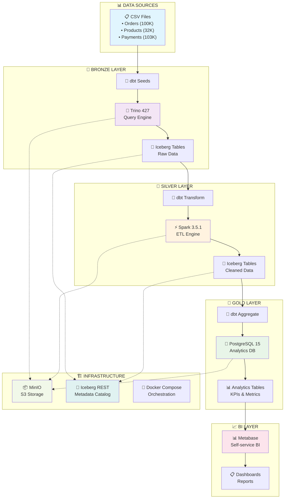

```mermaid
graph TB
    subgraph "📊 DATA SOURCES"
        CSV["📋 CSV Files<br/>• Orders (100K)<br/>• Products (32K)<br/>• Payments (103K)"]
    end
    
    subgraph "🥉 BRONZE LAYER"
        DBT1["🔄 dbt Seeds"]
        TRINO["🎯 Trino 427<br/>Query Engine"]
        ICE1["🧊 Iceberg Tables<br/>Raw Data"]
    end
    
    subgraph "🥈 SILVER LAYER" 
        DBT2["🔄 dbt Transform"]
        SPARK["⚡ Spark 3.5.1<br/>ETL Engine"]
        ICE2["🧊 Iceberg Tables<br/>Cleaned Data"]
    end
    
    subgraph "🥇 GOLD LAYER"
        DBT3["🔄 dbt Aggregate"] 
        POSTGRES["🐘 PostgreSQL 15<br/>Analytics DB"]
        TABLES["📊 Analytics Tables<br/>KPIs & Metrics"]
    end
    
    subgraph "📈 BI LAYER"
        METABASE["📊 Metabase<br/>Self-service BI"]
        DASH["📋 Dashboards<br/>Reports"]
    end
    
    subgraph "🏗️ INFRASTRUCTURE"
        MINIO["📦 MinIO<br/>S3 Storage"]
        ICEBERG["🧊 Iceberg REST<br/>Metadata Catalog"]
        DOCKER["🐳 Docker Compose<br/>Orchestration"]
    end
    
    CSV --> DBT1
    DBT1 --> TRINO
    TRINO --> ICE1
    ICE1 --> DBT2
    DBT2 --> SPARK  
    SPARK --> ICE2
    ICE2 --> DBT3
    DBT3 --> POSTGRES
    POSTGRES --> TABLES
    TABLES --> METABASE
    METABASE --> DASH
    
    TRINO -.-> MINIO
    SPARK -.-> MINIO
    POSTGRES -.-> MINIO
    ICE1 -.-> ICEBERG
    ICE2 -.-> ICEBERG
    
    style CSV fill:#e1f5fe
    style TRINO fill:#f3e5f5
    style SPARK fill:#fff3e0
    style POSTGRES fill:#e8f5e8
    style METABASE fill:#fce4ec
    style MINIO fill:#f1f8e9
    style ICEBERG fill:#e0f2f1
```