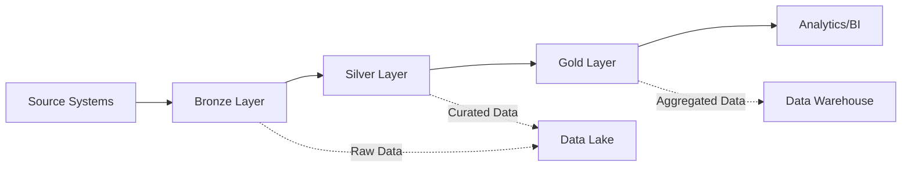

# Technical Deep Dive: Data Architecture Patterns

This document provides a technical analysis of the advanced patterns and practices demonstrated in this project.

## 🏛️ Medallion Architecture Implementation

### Design Principles

The medallion architecture (Bronze → Silver → Gold) implements several key design principles:

1. **Single Source of Truth**: Raw data is preserved in Bronze
2. **Immutable Data**: Apache Iceberg provides versioning and time travel
3. **Progressive Enhancement**: Each layer adds business value
4. **Fault Tolerance**: Layer isolation prevents cascade failures

### Layer Responsibilities



#### Bronze Layer: Data Ingestion
- **Responsibility**: Exact replica of source systems
- **Processing**: Minimal (schema validation, data typing)
- **Storage**: Apache Iceberg format for ACID compliance
- **Retention**: Long-term (years) for audit and replay

#### Silver Layer: Data Curation  
- **Responsibility**: Business logic application
- **Processing**: Joins, deduplication, standardization
- **Storage**: Optimized Iceberg tables with partitioning
- **Retention**: Medium-term (months to years)

#### Gold Layer: Analytics Aggregation
- **Responsibility**: Business metrics and KPIs
- **Processing**: Aggregations, calculations, denormalization
- **Storage**: Fast-query optimized (PostgreSQL)
- **Retention**: Configurable based on business needs

## 🔄 Multi-Engine Processing Strategy

### Engine Selection Matrix

| Layer | Engine | Reasoning | Trade-offs |
|-------|--------|-----------|------------|
| Bronze | Trino | Fast federated queries, broad connector support | Limited transformation capabilities |
| Silver | Spark | Massive parallel processing, rich transformations | Higher resource requirements |
| Gold | Trino + PostgreSQL | Interactive analytics, BI tool compatibility | Less suitable for heavy ETL |

### Cross-Engine Data Flow

```python
# Conceptual data flow
def data_pipeline():    # Bronze: dbt seeds loaded into Apache Iceberg
    SELECT customer_data FROM seeds.ecommerce
    """).write_iceberg("s3://warehouse/bronze/")

    # Silver: Spark reads Iceberg, transforms, writes Iceberg
    silver_data = spark.read.iceberg("s3://warehouse/bronze/") 
        .transform(business_logic) 
        .write.iceberg("s3://warehouse/silver/")

    # Gold: Trino reads Iceberg, writes to PostgreSQL    trino.query("""
        INSERT INTO postgres.schema.metrics
        SELECT aggregated_metrics FROM iceberg.warehouse.silver
    """)
```

SELECT * FROM {{ source('orders') }}

### Profile Strategy Pattern

The multi-profile approach allows engine-specific optimizations:

```yaml
# profiles.yml - Engine-specific configurations
trino:
      type: trino
      # Optimized for fast federated queries
      threads: 1  # Trino handles parallelism internally
      
spark:
  outputs:
    dev:
      type: spark
      # Optimized for heavy transformations
      connect_retries: 5
      retry_all: true
      
gold:
  outputs:
    dev:
      type: trino
      database: de_psql  # Different catalog/database
```

### Incremental Strategy Patterns

#### Bronze Layer: Delete+Insert Strategy
```sql
{{
    config(
        materialized='incremental',
        incremental_strategy='delete+insert',
        unique_key='order_id'
    )
}}

-- Simple replication with full partition refresh
SELECT * FROM {{ source('warehouse', 'bronze_orders') }}

    WHERE updated_at > (SELECT MAX(updated_at) FROM {{ this }})

```

#### Silver Layer: Merge Strategy
```sql
{{
    config(
        materialized='incremental',
        incremental_strategy='merge',
        unique_key='order_id',
        merge_exclude_columns=['created_at']
    )
}}

-- Complex business logic with upserts
SELECT 
    order_id,
    customer_id,
    business_transformation(raw_data) as processed_value,
    CURRENT_TIMESTAMP as updated_at
FROM {{ ref('bronze_orders') }}
```

### Dependency Management

```yaml
# sources.yml - Cross-layer dependencies
sources:
  - name: silver
    description: "Silver layer outputs consumed by Gold"
    tables:
      - name: fact_sales
        description: "Clean sales transactions"
        freshness:
          warn_after: {count: 6, period: hour}
          error_after: {count: 12, period: hour}
```

## 🗄️ Data Lake Architecture

### Storage Layout Strategy

```
s3://warehouse/
├── bronze/
│   ├── orders/
│   │   ├── year=2023/month=01/day=01/
│   │   └── year=2023/month=01/day=02/
│   └── products/
├── silver/
│   ├── dim_products/
│   └── fact_sales/
└── gold/
    └── aggregated_metrics/
```

### Apache Iceberg Features Utilized

1. **ACID Transactions**: Consistent reads during writes
2. **Time Travel**: Historical data analysis and debugging
3. **Schema Evolution**: Non-breaking schema changes
4. **Optimizations**: Data file compaction and sorting

```sql
-- Time travel example
SELECT * FROM iceberg.warehouse.bronze.orders
FOR TIMESTAMP AS OF TIMESTAMP '2023-01-01 00:00:00'

-- Schema evolution example  
ALTER TABLE iceberg.warehouse.silver.products
ADD COLUMN new_feature STRING
```

### Partitioning Strategy

```yaml
# dbt model config
{{ 
  config(
    partition_by=['year', 'month'],
    clustered_by=['customer_id'],
    buckets=16
  )
}}
```

## 🔧 Infrastructure Patterns

### Container Orchestration Strategy

```yaml
# docker-compose.yml patterns
services:
  # Service dependency management
  trino:
    depends_on:
      hive-metastore:
        condition: service_healthy
      
  # Health check patterns
  spark-master:
    healthcheck:
      test: ["CMD", "curl", "-f", "http://localhost:8080"]
      interval: 15s
      timeout: 5s
      retries: 5
      
  # Resource management
  spark-worker:
    deploy:
      replicas: 2
    environment:
      SPARK_WORKER_MEMORY: "2G"
      SPARK_WORKER_CORES: "1"
```

### Configuration Management

```bash
# .env file pattern - Centralized configuration
WAREHOUSE_S3=s3://warehouse
POSTGRES_HOST=de_psql
MINIO_URL=http://minio:9000

# Environment-specific overrides
SPARK_WORKER_MEMORY=${SPARK_WORKER_MEMORY:-2G}
```

### Network Architecture

```yaml
networks:
  data_network:
    driver: bridge
    name: data_network
```

All services communicate through a dedicated bridge network, providing:
- Service discovery by hostname
- Network isolation from host
- Inter-service communication optimization

## 🧪 Testing and Quality Patterns

### Data Quality Framework

```yaml
# schema.yml - Comprehensive testing
models:
  - name: fact_sales
    tests:
      # Integrity tests
      - unique:
          column_name: "order_id||product_id"
      - not_null:
          column_name: [order_id, product_id]
      
      # Business logic tests  
      - dbt_utils.accepted_range:
          column_name: payment_value
          min_value: 0
          
      # Freshness tests
    columns:
      - name: order_purchase_timestamp
        tests:
          - dbt_utils.not_older_than:
              datepart: day
              interval: 7
```

### Custom Test Macros

```sql
-- macros/test_order_integrity.sql

    SELECT COUNT(*)
    FROM {{ model }}
    WHERE {{ order_id_column }} IN (
        SELECT {{ order_id_column }}
        FROM {{ model }}
        GROUP BY {{ order_id_column }}
        HAVING COUNT(*) > 1
    )

```

## 📈 Performance Optimization Patterns

### Query Optimization

1. **Predicate Pushdown**: Filters applied at source
2. **Projection Pushdown**: Only required columns selected
3. **Join Optimization**: Broadcast joins for small dimensions

### Storage Optimization

```sql
-- Spark SQL optimization commands
CALL system.rewrite_datafiles('warehouse.silver.fact_sales')
ZORDER BY (order_date, customer_id);

-- Vacuum old versions
ALTER TABLE iceberg.warehouse.silver.fact_sales EXECUTE expire_snapshots(retention_threshold => 168);
```

### Memory Management

```yaml
# Spark configuration tuning
spark-defaults.conf: |
  spark.sql.adaptive.enabled=true
  spark.sql.adaptive.coalescePartitions.enabled=true
  spark.sql.adaptive.skewJoin.enabled=true
  spark.serializer=org.apache.spark.serializer.KryoSerializer
```

## 🔐 Security and Governance

### Access Control Strategy

```yaml
# Catalog-level security
catalogs:
  warehouse:
    access_control: role_based
    roles:
      - data_engineer: [SELECT, INSERT, CREATE]
      - analyst: [SELECT]
      - admin: [ALL]
```

### Data Lineage

dbt automatically generates lineage through:
- `ref()` function usage
- Source definitions
- Documentation propagation

### Audit Trail

```sql
-- Example audit table pattern
CREATE TABLE audit.data_pipeline_runs (
    run_id STRING,
    model_name STRING,
    start_time TIMESTAMP,
    end_time TIMESTAMP,
    status STRING,
    records_processed BIGINT
);
```

## 🚀 Scalability Considerations

### Horizontal Scaling Patterns

1. **Spark Workers**: Scale based on data volume
2. **Trino Workers**: Scale based on query complexity
3. **Storage**: MinIO supports multi-node clusters

### Cost Optimization

1. **Spot Instances**: For batch processing workloads
2. **Storage Tiering**: Hot/warm/cold data strategies
3. **Compute Scheduling**: Off-peak processing for cost savings

This technical deep dive provides the foundation for understanding and extending the architecture patterns demonstrated in this project.